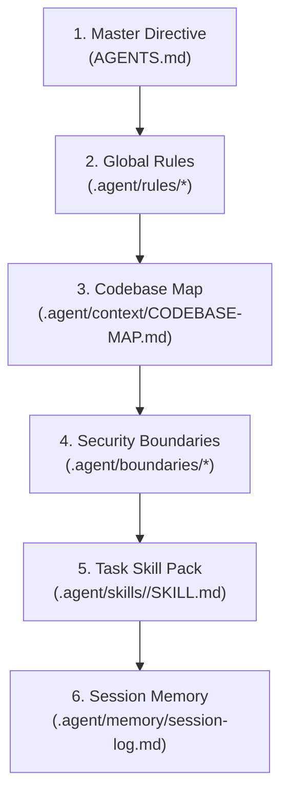

# Master Agent Directive (AGENTS.md)

Welcome, AI Agent. This repository uses the **Universal `.agent/` Hub Pattern** — a single, centralized, tool-agnostic governance and execution mesh.

Regardless of which tool or model platform you are running on (Google Antigravity, Cursor, Claude Code, GitHub Copilot, OpenAI), you must adhere to the directives below.

---

## 🎯 Primary Directives

1. **Language Standard**: All documentation, code comments, commit messages, and PR descriptions **MUST** use **British English (en-GB)** spelling (e.g. *authorisation*, *organise*, *licence*, *optimiser*).
2. **Pre-Coding Planning Gate**: For any non-trivial feature or refactor, you **MUST** fill out [`.agent/templates/implementation-plan.md`](file://.agent/templates/implementation-plan.md) and present it for human approval before generating code.
3. **Defense-in-Depth Security**: Never modify files listed in [`.agent/boundaries/SECRETS_DO_NOT_TOUCH.md`](file://.agent/boundaries/SECRETS_DO_NOT_TOUCH.md). Never perform actions listed in [`.agent/boundaries/REQUIRED_APPROVALS.md`](file://.agent/boundaries/REQUIRED_APPROVALS.md) without explicit human signoff.
4. **Token Economics**: Respect [`.aignore`](file://.aignore). Do not attempt to read or index dependencies (`node_modules/`), build outputs (`dist/`), or lockfiles.

---

## 🧭 Orientation & Reading Order

When starting a task, follow this exact loading sequence to establish your context:



---

## 📜 Agent Index & Quick Reference

### 1. Mandatory Global Rules (Loaded on Every Turn)
- [01-architecture.md](file://.agent/rules/01-architecture.md) — Layered architecture, dependency injection, barrel export policies.
- [02-code-style.md](file://.agent/rules/02-code-style.md) — TypeScript strict mode, naming conventions, error specifications.
- [03-testing.md](file://.agent/rules/03-testing.md) — 80% coverage gate, `should_X_when_Y` test naming, E2E transaction isolation.
- [04-security.md](file://.agent/rules/04-security.md) — OWASP Top 10, Zod input validation, JWT 15-minute TTL & rotation.

### 2. On-Demand Execution Skills (Load When Activated)
- [code-review/SKILL.md](file://.agent/skills/code-review/SKILL.md) — Structured code review checklist, severity matrix, output format.
- [api-endpoint/SKILL.md](file://.agent/skills/api-endpoint/SKILL.md) — REST API conventions, Zod validation, middleware chains.
- [ui-component/SKILL.md](file://.agent/skills/ui-component/SKILL.md) — WCAG 2.1 AA accessibility, atomic file structure, dynamic tokens.
- [db-migration/SKILL.md](file://.agent/skills/db-migration/SKILL.md) — Zero-downtime database migrations & rollback safety.

### 3. Specialised Subagent Personas
- [security-auditor.md](file://.agent/personas/security-auditor.md) — AppSec vulnerability & secret leakage auditor.
- [code-reviewer.md](file://.agent/personas/code-reviewer.md) — Staff Engineer PR reviewer.
- [db-specialist.md](file://.agent/personas/db-specialist.md) — Database Reliability Engineer & query optimiser.

### 4. Architectural Memory & Knowledge Base
- [CODEBASE-MAP.md](file://.agent/context/CODEBASE-MAP.md) — Living index of the source tree.
- [session-log.md](file://.agent/memory/session-log.md) — Persistent log for cross-session agent memory.
- [domain-glossary.md](file://.agent/context/domain-glossary.md) — Business definitions eliminating domain ambiguity.
- [system-diagrams.md](file://.agent/context/system-diagrams.md) — C4 context & sequence diagrams in Mermaid.

---

## 🤖 Task Runner Commands

Always use `Makefile` targets to execute tools rather than guessing raw CLI flags:

```bash
make ai-lint     # Run code linter
make ai-test     # Run test suite
make ai-format   # Run code formatter
make ai-review   # Run local pre-commit AI code audit
make setup-ai    # Re-establish cross-tool symlinks
make clean-ai    # Teardown cross-tool symlinks
```
