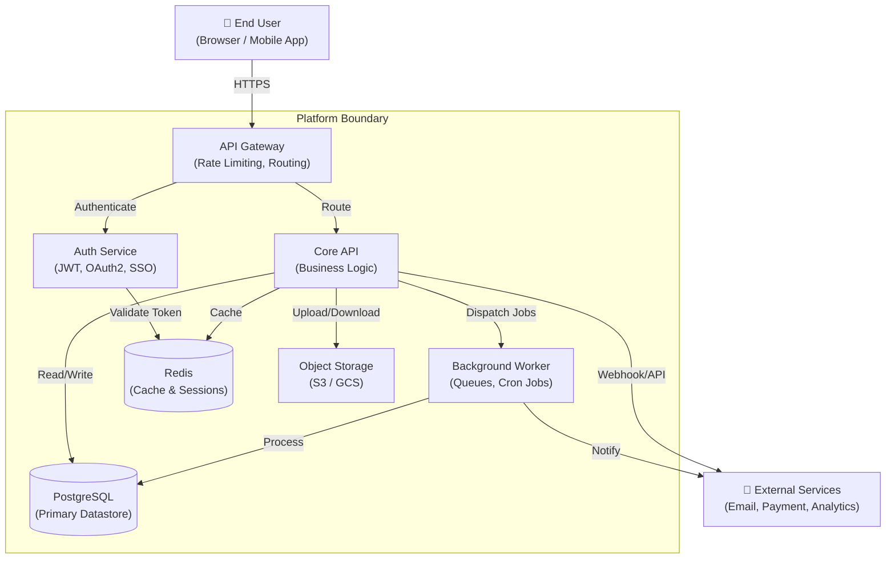
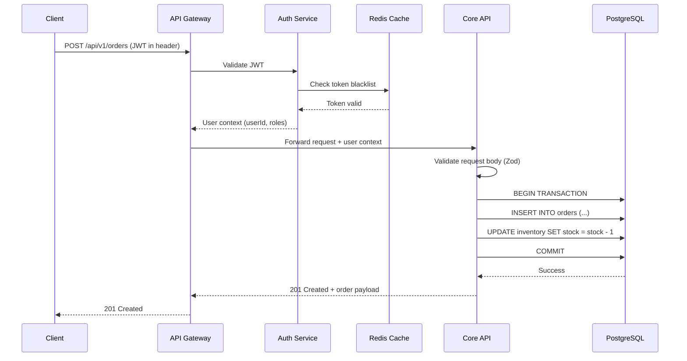

# System Architecture Diagrams

## C4 Context Diagram

```mermaid
graph TB
    User["👤 End User<br/>(Browser / Mobile App)"]
    
    subgraph Platform ["Platform Boundary"]
        Gateway["API Gateway<br/>(Rate Limiting, Routing)"]
        Auth["Auth Service<br/>(JWT, OAuth2, SSO)"]
        API["Core API<br/>(Business Logic)"]
        Worker["Background Worker<br/>(Queues, Cron Jobs)"]
        DB[("PostgreSQL<br/>(Primary Datastore)")]
        Cache[("Redis<br/>(Cache & Sessions)")]
        Storage["Object Storage<br/>(S3 / GCS)"]
    end
    
    External["📧 External Services<br/>(Email, Payment, Analytics)"]

    User -->|HTTPS| Gateway
    Gateway -->|Authenticate| Auth
    Gateway -->|Route| API
    Auth -->|Validate Token| Cache
    API -->|Read/Write| DB
    API -->|Cache| Cache
    API -->|Upload/Download| Storage
    API -->|Dispatch Jobs| Worker
    Worker -->|Process| DB
    Worker -->|Notify| External
    API -->|Webhook/API| External
```

## Authenticated API Request — Sequence Diagram

```mermaid
sequenceDiagram
    participant Client
    participant Gateway as API Gateway
    participant Auth as Auth Service
    participant Redis as Redis Cache
    participant API as Core API
    participant DB as PostgreSQL

    Client->>Gateway: POST /api/v1/orders (JWT in header)
    Gateway->>Auth: Validate JWT
    Auth->>Redis: Check token blacklist
    Redis-->>Auth: Token valid
    Auth-->>Gateway: User context (userId, roles)
    Gateway->>API: Forward request + user context
    API->>API: Validate request body (Zod)
    API->>DB: BEGIN TRANSACTION
    API->>DB: INSERT INTO orders (...)
    API->>DB: UPDATE inventory SET stock = stock - 1
    API->>DB: COMMIT
    DB-->>API: Success
    API-->>Gateway: 201 Created + order payload
    Gateway-->>Client: 201 Created
```
