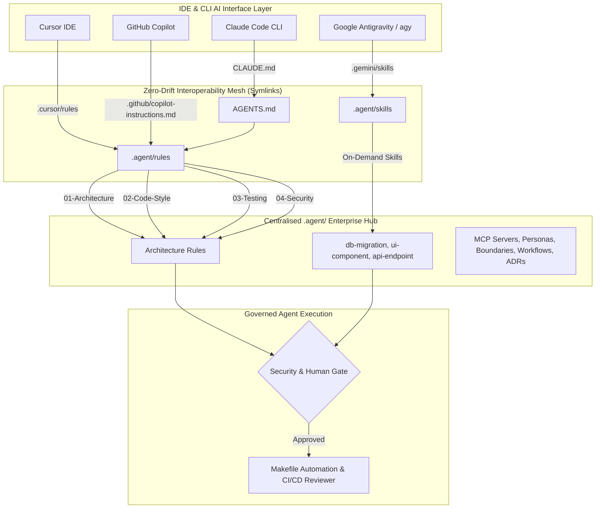
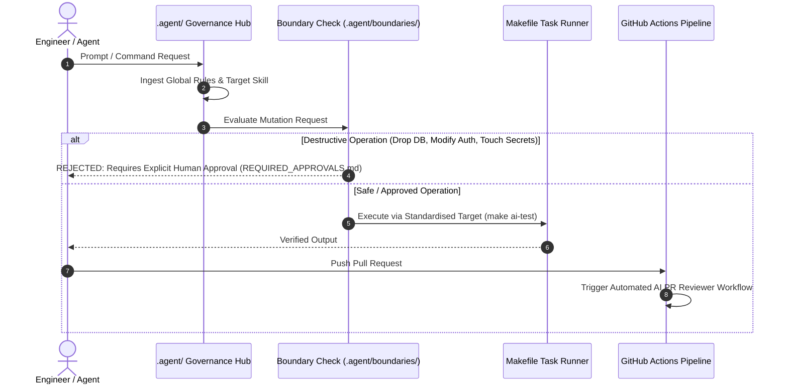

# Enterprise Multi-Model AI Context Architecture

[](file:///Users/hadi/dev/ai/llm/.agent)
[](#executive-summary--architectural-vision)
[](file:///Users/hadi/dev/ai/llm/.agent/boundaries)
[](#token-economics--context-window-optimization)
[](file:///Users/hadi/dev/ai/llm/.agent/rules/04-security.md)

The **production-grade reference architecture** engineered for enterprise software organisations operating multi-model AI coding agents at scale. 

Eliminates **AI Architectural Drift**, **Context Window Saturation**, and **Unsanctioned Agent Mutations** across heterogeneous toolchains (Google Antigravity, Claude Code, Cursor, GitHub Copilot, Codex, and custom SDK subagents).

---

## Executive Summary & Architectural Vision

> [!IMPORTANT]
> **The Enterprise AI Bottleneck**: As engineering organisations adopt AI tools, developer environments fragment into siloed prompt rules (`.cursorrules`, `.claude/`, `copilot-instructions.md`). This results in context drift, duplicated maintenance, token bloat, and uncontrolled agent mutations in production repos.

This repository implements the **Universal `.agent/` Hub Pattern** — a single, centralised, tool-agnostic governance and execution mesh.



---

## Zero-Trust Security & Governance Pipeline

No AI agent should ever have unrestricted execution privileges in an enterprise codebase. This template enforces a **4-Layer Defense-in-Depth Pipeline**:



---

## Token Economics & Context Window Optimization

Enterprise LLMs (Claude 3.5/3.7, Gemini 1.5/2.0 Pro/Flash, GPT-4o) charge per input token and suffer from **context degradation** when overloaded with monolithic prompt files.

### Monolithic Rules vs. Universal `.agent/` Architecture

| Metric | Monolithic Prompts (`.cursorrules` / mega-prompts) | Universal `.agent/` Architecture | Enterprise Impact |
| :--- | :--- | :--- | :--- |
| **Turn Context Footprint** | ~50,000 – 100,000 tokens | **~800 – 1,500 tokens** | **90–95% Token Reduction** |
| **API Cost per PR** | $1.50 – $4.50 | **$0.05 – $0.15** | **95% Cost Savings at Scale** |
| **Hallucination Rate** | High (Drowned out by noise) | **Near Zero (High Signal-to-Noise)** | Deterministic Output |
| **Model Drift across Tools** | High (Config fragmentation) | **Zero (Single Source of Truth)** | Unified Team Output |

> [!TIP]
> **On-Demand Skill Ingestion**: Global rules (`.agent/rules/`) are kept ultra-lean (<1,000 tokens). Complex domain workflows are encapsulated in standalone `SKILL.md` packages that agents load **only when executing that specific task**.

---

## Comprehensive Directory Blueprint

```text
my-project/
├── AGENTS.md                       # 🌟 Master Entrypoint: Core guidelines, directives & agent index
├── CLAUDE.md                       # Symlink → AGENTS.md (Claude Code CLI compatibility)
├── CONTRIBUTING.md                 # Symlink → docs/CONTRIBUTING.md (Human contributor guide)
├── ARCHITECTURE.md                 # Symlink → docs/ARCHITECTURE.md (Human architecture index)
├── Makefile                        # 🤖 Agentic Task Runner (setup-ai, clean-ai, ai-lint, ai-test)
├── .editorconfig                   # 📐 Universal formatting baseline (tabs, spaces, charsets)
├── .gitignore                       # 🛡️ Excludes agent workspace logs, scratch files & memory DBs
├── .aignore                        # 🙈 AI Context Ignore (Prevents indexing dist/, node_modules/ to save tokens)
│
├── .agent/                         # 🚀 Centralised AI Governance & Multi-Agent Core
│   │
│   ├── rules/                      # 📜 Mandatory Global Rules (Loaded on EVERY turn)
│   │   ├── 01-architecture.md      #   Layered architecture, DI patterns, barrel export policy
│   │   ├── 02-code-style.md        #   TypeScript strict mode, naming conventions, error specs
│   │   ├── 03-testing.md           #   80% line coverage gate, test naming, E2E isolation
│   │   └── 04-security.md          #   OWASP Top 10, Zod input validation, JWT rotation rules
│   │
│   ├── skills/                     # 🧰 On-Demand Execution Packs (Loaded only when task active)
│   │   ├── db-migration/
│   │   │   ├── SKILL.md            #   Prisma/SQL migration workflow & safety checks
│   │   │   └── templates/          #   Migration SQL boilerplate
│   │   ├── ui-component/
│   │   │   ├── SKILL.md            #   Design tokens, WCAG 2.1 AA accessibility, component trees
│   │   │   └── examples/           #   Golden-file reference implementations
│   │   ├── api-endpoint/
│   │   │   ├── SKILL.md            #   REST conventions, Zod validation, middleware chains
│   │   │   └── scripts/            #   OpenAPI generation & schema validation scripts
│   │   └── code-review/
│   │       └── SKILL.md            #   Structured review checklist, severity matrix & output format
│   │
│   ├── personas/                   # 🎭 Specialized Subagent Roles (Multi-Agent Workflows)
│   │   ├── security-auditor.md     #   OWASP vulnerability & secret leakage auditor
│   │   ├── code-reviewer.md        #   Staff Engineer PR reviewer persona
│   │   └── db-specialist.md        #   Database Reliability Engineer & query optimiser
│   │
│   ├── workflows/                  # 📋 Standard Operating Procedures (SOPs)
│   │   ├── PR-PREPARATION.md       #   7-step pre-flight checklist before opening PRs
│   │   └── RELEASE-CHECK.md        #   7-step release verification & rollback protocol
│   │
│   ├── mcp/                        # 🔌 Model Context Protocol (MCP) Grounding
│   │   ├── servers.json            #   Configured MCP servers (PostgreSQL, GitHub, Jira)
│   │   └── api-specs/              #   OpenAPI/Swagger schemas ingested as live tools
│   │
│   ├── boundaries/                 # ⛔ Hard Security Isolation & Human Gates
│   │   ├── SECRETS_DO_NOT_TOUCH.md #   Files strictly forbidden from AI modification (.env, keys)
│   │   └── REQUIRED_APPROVALS.md   #   High-risk actions requiring human YES/NO signoff
│   │
│   ├── hooks/                      # 🪝 Pre-Commit & Verification Hooks
│   │   └── pre-commit.md           #   4-gate local validation (lint, tsc, gitleaks, tests)
│   │
│   ├── templates/                  # 📝 Standardised Outputs
│   │   ├── implementation-plan.md  #   Pre-coding design plan human must approve
│   │   ├── pull-request.md         #   Enterprise PR description template
│   │   └── commit-message.md       #   Conventional Commits specification
│   │
│   └── context/                    # 🧠 Architectural Memory & Knowledge Base
│       ├── adr/                    #   Architectural Decision Records
│       │   ├── 0001-use-postgresql.md
│       │   └── 0002-state-management.md
│       ├── CODEBASE-MAP.md         #   Living index of src layout for instant agent orientation
│       ├── system-diagrams.md      #   Mermaid C4 context & sequence diagrams
│       └── domain-glossary.md      #   Unambiguous business term definitions
│
├── .agent/memory/                  # 🧩 Persistent Cross-Session Agent Memory
│   └── session-log.md              #   Dated log of key decisions, constraints & lessons learned
│
├── .agent/evals/                   # 🧪 Prompt Engineering & LLM-as-a-judge tests
│   └── README.md                   #   Instructions for testing agent regressions
│
├── .cursor/                        # Cursor IDE Integration
│   └── rules/ -> ../.agent/rules   #   Symlink to central rules directory
├── .gemini/                        # Google Antigravity / Gemini CLI Integration
│   └── skills -> ../.agent/skills   #   Symlink to central skills directory
├── .claude/                        # Claude Code Integration
│   └── settings.json               #   Team-shared tool permission allow/deny lists
├── .github/                        # CI/CD & Automated Governance
│   ├── copilot-instructions.md     #   GitHub Copilot custom instructions
│   └── workflows/
│       └── ai-pr-reviewer.yml      #   Automated GitHub Action PR code review workflow
└── docs/                           # Human-facing project documentation
```

---

## Multi-Agent Persona Execution Matrix

When operating in subagent or multi-agent environments (e.g. Antigravity or Claude Code), agents assume specialized personas to audit and validate code:

```text
┌─────────────────────────────────────────────────────────────────────────────────┐
│                          MAIN AGENT ORCHESTRATOR                                │
└─────────┬──────────────────────────────┬──────────────────────────────┬─────────┘
          │                              │                              │
          ▼                              ▼                              ▼
┌──────────────────┐           ┌──────────────────┐           ┌──────────────────┐
│ Security Auditor │           │  DB Specialist   │           │  Code Reviewer   │
│ (.agent/personas/│           │ (.agent/personas/│           │ (.agent/personas/│
│ security-auditor)│           │  db-specialist)  │           │  code-reviewer)  │
├──────────────────┤           ├──────────────────┤           ├──────────────────┤
│ • OWASP Top 10   │           │ • N+1 Query Audit│           │ • 80% Test Coverage│
│ • Secret Scan    │           │ • Index Coverage │           │ • Clean Arch      │
│ • JWT Rotation   │           │ • Rollback Safety│           │ • Type Safety     │
└──────────────────┘           └──────────────────┘           └──────────────────┘
```

---

## Operational Runbook: Developer Setup

### 1. One-Command Environment Bootstrap
To bind all AI tools to the central governance hub in a newly cloned repository:

```bash
make setup-ai
```

This command automatically generates the cross-tool symlinks:
- `CLAUDE.md` ➔ `AGENTS.md`
- `.cursor/rules/agent-rules` ➔ `.agent/rules`
- `.gemini/skills` ➔ `.agent/skills`

### 2. Teardown / Reset
To cleanly unlink the AI integration without modifying core repository rules:

```bash
make clean-ai
```

### 3. Agent-Safe Commands
Agents invoke Makefile targets rather than guessing complex CLI arguments:

```bash
make ai-lint     # Run linter per .agent/rules/02-code-style.md
make ai-test     # Run test suite per .agent/rules/03-testing.md
make ai-format   # Run auto-formatter
make ai-review   # Run local pre-commit AI code audit
```

---

## Enterprise Compliance Mapping

> [!CAUTION]
> Unregulated AI agents pose severe risks of secret leakage, licence violation, and architectural erosion. This repository enforces compliance out of the box:

- **SOC 2 Type II / ISO 27001**: Audit trail enforcement via Conventional Commits ([`commit-message.md`](file:///Users/hadi/dev/ai/llm/.agent/templates/commit-message.md)) and mandatory human gates ([`REQUIRED_APPROVALS.md`](file:///Users/hadi/dev/ai/llm/.agent/boundaries/REQUIRED_APPROVALS.md)).
- **OWASP Top 10**: Enforced at the boundary layer ([`04-security.md`](file:///Users/hadi/dev/ai/llm/.agent/rules/04-security.md)) with Zod schema validation and parameterized query requirements.
- **GDPR / PII Isolation**: Hard restrictions preventing agents from logging, printing, or transmitting sensitive user data ([`SECRETS_DO_NOT_TOUCH.md`](file:///Users/hadi/dev/ai/llm/.agent/boundaries/SECRETS_DO_NOT_TOUCH.md)).

---

## Adapting for Your Enterprise Tech Stack

This framework is **stack-agnostic**. To deploy this template across your organisation:

1. **Customise Global Rules** (`.agent/rules/`): Swap TypeScript rules for Go, Python, Java, or Rust conventions.
2. **Expand Skill Packs** (`.agent/skills/`): Add domain packs for `terraform/`, `kubernetes/`, `graphql/`, or `kafka/`.
3. **Register MCP Tools** (`.agent/mcp/servers.json`): Bind internal enterprise APIs and database tools.
4. **Enforce in CI/CD**: Deploy `.github/workflows/ai-pr-reviewer.yml` across all organisation repositories.

---

*Engineered for high-velocity, multi-agent AI software development.*
